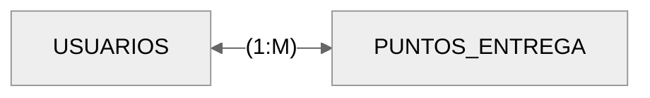
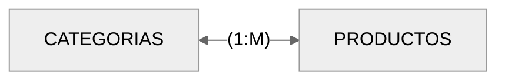
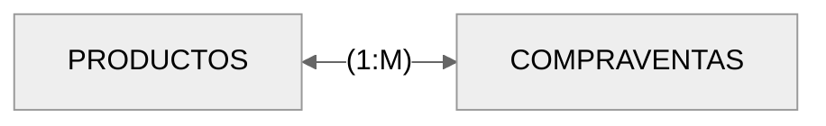
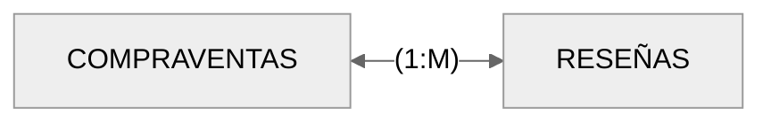
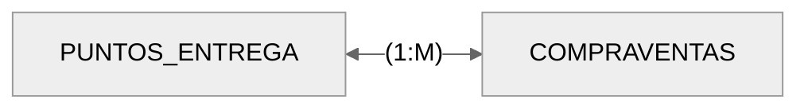
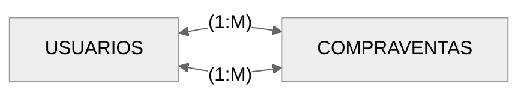
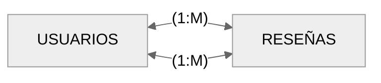

# Base de Dades: ProxiMarkt

## Descripción general

La base de datos permite guardar y organizar toda la información que necesita la plataforma para su correcto funcionamiento. Su objetivo principal es mantener y relacionar la información de usuarios y productos principalmente. Que son el corazón de la aplicación. Permite guardar chats y mensajes entre usuarios.

- Motor: Mysql
- Versión: 8

## Diagrama Entidad - Relación con atributos


### Relaciones

#### Chats - Mensajes


Cada mensaje pertenece a un único chat; un chat puede contener varios mensajes.

#### Mensajes - Usuarios


Cada mensaje es enviado por un único usuario; un usuario puede enviar muchos mensajes.

#### Usuarios - Puntos_entrega



Cada punto de entrega es asignado por un usuario; un usuario puede asignarse varios puntos de entrega.

#### Usuarios - Productos


Un usuario puede publicar varios productos; cada producto pertenece a un único usuario.

#### Chats - Productos


Cada chat está asociado a un único producto; un producto puede tener varios chats simuláneos (mismo vendedor, diferentes compradores).

#### Categorías - Productos



Cada producto pertenece a una categoría; una categoría puede tener muchos productos.

En un futuro se espera implementar que un producto pertenezca a varias categorías. E incluso que una categoría pueda tener subcategorías.

#### Productos - Compraventas



Cada producto puede generar varias compraventas; cada compraventa corresponde a un único producto.

#### Compraventas - Reseñas



Una compraventa puede generar un máximo de 2 reseñas (comprador y vendedor); cada reseña pertenece a una única compraventa.

#### Puntos_entrega - Compraventas



Una compraventa puede tener lugar en un único punto de entrega. En un punto de entrega ocurren muchas operaciones de compraventa.

#### Usuarios - Compraventas



Un único usuario con rol de comprador participa en la compraventa.
Un único usuario con rol de vendedor participa en la compraventa.
Cada usuario puede realizar muchas compraventas.

#### Usuarios - Reseñas



En cada reseña participa un único usuario reseñador.
En cada reseña participa un único usuario reseñado.
Un usuario puede tener muchas reseñas.

#### Usuarios - Chats


Un chat tiene dos únicos participantes (comprador - vendedor).
Los usuarios pueden tener muchos chats.

### Tablas y campos

#### **Tabla usuarios**

```sql
CREATE TABLE usuarios (
    id INT AUTO_INCREMENT PRIMARY KEY,
    nombre_usuario VARCHAR(255) NOT NULL,
    email VARCHAR(255) UNIQUE NOT NULL,
    contrasenya VARCHAR(255) NOT NULL,
    telefono VARCHAR(20) UNIQUE NOT NULL,
    direccion VARCHAR(255),
    longitud DECIMAL(10, 8),
    latitud DECIMAL(10, 8),
    puntuacio DOUBLE DEFAULT 0,
    created_at TIMESTAMP NOT NULL DEFAULT CURRENT_TIMESTAMP,
    updated_at TIMESTAMP DEFAULT CURRENT_TIMESTAMP ON UPDATE CURRENT_TIMESTAMP
);

```

#### **Tabla categorias**

```sql
CREATE TABLE categorias (
    id INT AUTO_INCREMENT PRIMARY KEY,
    nombre_categoria VARCHAR(255) NOT NULL,
    created_at TIMESTAMP NOT NULL DEFAULT CURRENT_TIMESTAMP,
    updated_at TIMESTAMP DEFAULT CURRENT_TIMESTAMP ON UPDATE CURRENT_TIMESTAMP
);
```

#### **Tabla puntos de entrega**

```sql
CREATE TABLE puntos_entrega (
    id INT AUTO_INCREMENT PRIMARY KEY,
    id_usuario INT,
    longitud DECIMAL(10, 8) NOT NULL,
    latitud DECIMAL(10, 8) NOT NULL,
    nombre_punto VARCHAR(255) NOT NULL,
    direccion_punto VARCHAR(255),
    created_at TIMESTAMP NOT NULL DEFAULT CURRENT_TIMESTAMP,
    updated_at TIMESTAMP DEFAULT CURRENT_TIMESTAMP ON UPDATE CURRENT_TIMESTAMP,
    FOREIGN KEY (id_usuario) REFERENCES usuarios (id)
);
```

#### **Tabla productos**

```sql
CREATE TABLE productos (
    id INT AUTO_INCREMENT PRIMARY KEY,
    id_categoria INT,
    id_usuario INT,
    id_puntoentrega INT,
    nombre_producto VARCHAR(255) NOT NULL,
    descripcion TEXT,
    precio DECIMAL(10, 2) NOT NULL,
    stock_total INT NOT NULL DEFAULT 0,
    stock_reserva INT NOT NULL DEFAULT 0,
    stock_real INT AS (stock_total - stock_reserva) STORED,
    imagen VARCHAR(255),
    estado ENUM(
        'agotado',
        'disponible'
    ) DEFAULT 'disponible',
    created_at TIMESTAMP NOT NULL DEFAULT CURRENT_TIMESTAMP,
    updated_at TIMESTAMP DEFAULT CURRENT_TIMESTAMP ON UPDATE CURRENT_TIMESTAMP,
    FOREIGN KEY (id_categoria) REFERENCES categorias (id),
    Foreign Key (id_usuario) REFERENCES usuarios(id),
    Foreign Key (id_puntoentrega) REFERENCES puntos_entrega(id)
);
```

#### **Tabla chat**

```sql
CREATE TABLE chats (
    id INT AUTO_INCREMENT PRIMARY KEY,
    id_comprador INT,
    id_vendedor INT,
    id_producto INT,
    created_at TIMESTAMP NOT NULL DEFAULT CURRENT_TIMESTAMP,
    updated_at TIMESTAMP DEFAULT CURRENT_TIMESTAMP ON UPDATE CURRENT_TIMESTAMP,
    FOREIGN KEY (id_comprador) REFERENCES usuarios (id),
    FOREIGN KEY (id_vendedor) REFERENCES usuarios (id),
    FOREIGN KEY (id_producto) REFERENCES usuarios (id),
    UNIQUE (
        id_comprador,
        id_vendedor,
        id_producto
    )
);
```

#### **Tabla mensajes**

```sql
CREATE TABLE mensajes (
    id INT AUTO_INCREMENT PRIMARY KEY,
    id_chat INT,
    id_envio INT,
    contenido TEXT NOT NULL,
    created_at TIMESTAMP NOT NULL DEFAULT CURRENT_TIMESTAMP,
    updated_at TIMESTAMP DEFAULT CURRENT_TIMESTAMP ON UPDATE CURRENT_TIMESTAMP,
    FOREIGN KEY (id_chat) REFERENCES chats (id),
    FOREIGN KEY (id_envio) REFERENCES usuarios (id)
);
```

#### **Tabla compraventas**

```sql
CREATE TABLE compraventas (
    id INT AUTO_INCREMENT PRIMARY KEY,
    id_producto INT,
    id_comprador INT,
    id_vendedor INT,
    id_punto INT,
    cantidad_total INT NOT NULL,
    estado ENUM(
        'pendiente',
        'en curso',
        'completado',
        'cancelado'
    ),
    created_at TIMESTAMP NOT NULL DEFAULT CURRENT_TIMESTAMP,
    updated_at TIMESTAMP DEFAULT CURRENT_TIMESTAMP ON UPDATE CURRENT_TIMESTAMP,
    FOREIGN KEY (id_producto) REFERENCES productos (id),
    FOREIGN KEY (id_comprador) REFERENCES usuarios (id),
    FOREIGN KEY (id_vendedor) REFERENCES usuarios (id),
    FOREIGN KEY (id_punto) REFERENCES puntos_entrega (id)
);
```

#### **Tabla valoraciones**

```sql
CREATE TABLE valoraciones (
    id_valoracion INT AUTO_INCREMENT PRIMARY KEY,
    id_venta INT,
    id_resenyador INT,
    id_resenyado INT,
    valoracion ENUM('1', '2', '3', '4', '5') NOT NULL,
    comentario TEXT,
    created_at TIMESTAMP NOT NULL DEFAULT CURRENT_TIMESTAMP,
    updated_at TIMESTAMP DEFAULT CURRENT_TIMESTAMP ON UPDATE CURRENT_TIMESTAMP,
    FOREIGN KEY (id_venta) REFERENCES compraventas (id),
    FOREIGN KEY (id_resenyador) REFERENCES usuarios (id),
    FOREIGN KEY (id_resenyado) REFERENCES usuarios (id),
    UNIQUE (
        id_venta,
        id_resenyador,
        id_resenyado
    )
);
```
